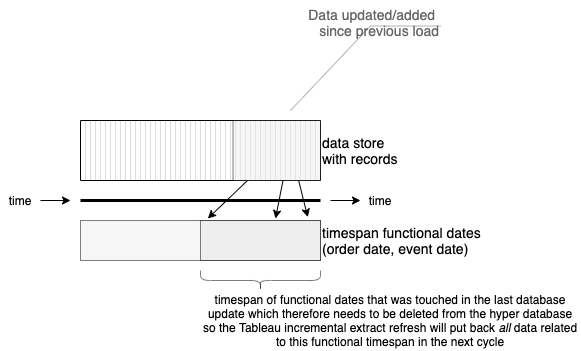
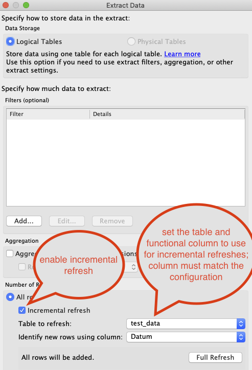

# tableau-incremental-refresh
Project that enables you to perform realistic incremental refreshes in a Tableau Server environment with databases as source system. It uses the Tableau Hyper, Document and Server Client API's to accomplish this. 
The following API's have been modified/forked by me to enhance their functionality as needed by this utility:
* [modified/forked Tableau document API](https://github.com/Bartman0/document-api-python)
* [modified/forked Tableau server client API](https://github.com/Bartman0/server-client-python)

Side note: I will try getting my modifications merged back into the main repo's. But for now, you have to use these modifications
through local installs.

The main goal of this code is to implemenent incremental refreshes within Tableau taking updates of existing data into consideration. The current incremental refresh of Tableau data sources is very limited: it only supports cases where only new data is added to the data(base) underlying a data source, but this is rarely the case in data warehouses. In all data warehouses that I know of, data is also updated frequently to reflect the latest attribute and measure values. And then the standard Tableau incremental refresh mode can not be applied. Only one option remains: a full refresh of data sources.
If your data warehouse is updated daily, and only data is added and updated for the last couple of days, it is very expensive to perform a full refresh of the data source for the whole history which can go up to several years of data. Just because a very limited amount of data is updated instead of merely added to the system.

This component fixes that: it uses the definition of specified data sources to perform several steps:
* it retrieves the data source from the server
* it determines the underlying extract Hyper file
* it removes to-be-updated data from that Hyper file
* it updates the incremental refresh information in the data source
* it deploys the updated data source to the server
* it schedules a regular incremental refresh



By cleaning the Hyper extract file from to-be-updated data and updating the incremental refresh information in the data source, the regular incremental refresh as performed by Tableau server can be applied succesfully again.
This way, data source refreshes that could take hours for large data sources, data wise of history wise, can be performed within minutes.

## Platforms

Since it is built in Python, this utility should run everywhere where Python and the required packages are supported.
However, I have seen that running it on macOS will result in strange and inconsistent outcomes. I logged an incident for that, and also 
tried involving the Tableau community ([problem using Hyper API](https://community.tableau.com/s/question/0D54T00000VB92SSAT/does-anybody-understand-this-hyper-database-behavior)). 
I will update this information if I receive some sort of resolution for it.

I know this utility to work on Windows.


## Benefits

The main benefit of this utility is that you only need to refresh updated/new data and you do not have to do
a complete refresh everytime of your datasources.
But please keep in mind, it will still take some time to do the refresh. The bottlenecks in the process are in two places:
- the utility needs to download the datasource including the full extract data
- the utility needs to publish the datasource again with the modified/prepared extract data

These download and upload phases may still run for minutes if the data extracts are big, for example multiple gigabytes.
There is no easy fix for that besides running fast computers and networks.

It would help if we could modify the hyper file on the Tableau server directly. That requires Tableau to open up that
possibility in their API's somehow.


## Run options

Basically, see the output of a run with --help as argument:

```text
usage: tableau-incremental-refresh.py [-h] --config CONFIG --server SERVER
                                      --username USERNAME -p P --project
                                      PROJECT [--site SITE]
                                      [--timeout TIMEOUT]
                                      [--frequency FREQUENCY] [--hyper HYPER]
                                      [--download DOWNLOAD]
                                      [--logging-level {debug,info,error}]
                                      datasource [datasource ...]

perform incremental refresh on datasources

positional arguments:
  datasource            one or more datasources to refresh

optional arguments:
  -h, --help            show this help message and exit
  --config CONFIG, -c CONFIG
                        configuration file
  --server SERVER, -s SERVER
                        server address
  --username USERNAME, -u USERNAME
                        username to sign in with into server
  -p P                  password corresponding to the username, use @file.txt
                        to read from file
  --project PROJECT, -P PROJECT
                        project to create extracts for
  --site SITE, -S SITE
  --timeout TIMEOUT, -t TIMEOUT
                        max wait time in seconds
  --frequency FREQUENCY, -f FREQUENCY
                        check frequency in seconds
  --hyper HYPER, -H HYPER
                        local hyper directory (when executed on server)
  --download DOWNLOAD, -D DOWNLOAD
                        local download directory for hyper extracts
  --logging-level {debug,info,error}, -l {debug,info,error}
                        desired logging level (set to error by default)
```

## Requirements

The program relies on JDBC, and therefore the **jaydebeapi** package to connect to databases. Also see the requirements.txt file.

Each datasource that needs to be refreshed incrementally must have the following characteristics:
* it must be a datasource that extracts data with a single base table (i.e. one table extract)
* it must be accompanied by a schedule with the same name
* it must be registered herein with an incremental refresh mode 
* it must have had a full refresh

The two requirements involving the schedule may sound weird, but this program uses a trick to refresh a datasource incrementally: it looks
for a schedule with the same name, adapts its scheduling time, and have that schedule do the actual work of
incrementally refreshing the datasource (after the data has been set up correctly in a republished hyper extract). The starting time 
of that schedule is the next 15 minute block increment after the current wall time (only quarters of an hour can be specified in the scheduling times).

Why this complex workaround?: Tableau has not enabled a method to refresh a datasource incrementally through its 
Tableau server client API. There exists a refresh method for datasources, but this will _always_ do **full** refreshes.
Hopefully this will change in the near future so we can get rid of this workaround and we can call an incremental refresh directly.

## Tableau settings

Datasources that are refreshed using this utility, must have extracts defined that have the incremental refresh enabled. See the
diagram for an example. The column to use must match the setting of the **functional_ordered_column** in the configuration file. See the next
paragraph for more details.



The **functional_ordered_column** must have a stable value (i.e. should not change during the lifetime of the record it is part of), it therefore 
is a functional column most of the time (order date, event data, etc), and it must have a value that is ordered over time. A functional date is
probably the best choice for this, but if some sort of sequence can be used that has the same characteristics that will work also.

## Datasource configuration details

In an accompanying configuration file, you must set the details for the datasource incremental refresh to be done effectively. The program needs
to know the functional column that will be used to do the incremental refresh on. This must be an ordered column with a functional purpose in the data (so no
technical identity column nor update datetime).

Example:
```json
{
  "databases": {
    "DATABASE": {
      "url": "jdbc:netezza://host1.inergy.nl:5480/CLIENT",
      "jars": "drivers/nzjdbc_v7.2.1.5-P1.jar",
      "class": "org.netezza.Driver",
      "args": { "user": "CLIENT_READER", "password": "*****" }
    }
  },
  "datasources": {
    "Visits incremental": {
      "functional_ordered_column": "DN_DATE",
      "reference_table": "WTFE_STORE_VISIT"
    }
  },
  "parameters": {
    "update_datetime_column": "TA_UPDATE_DATETIME",
    "update_values": "update.json"
  }
}
```

The _parameters_ section defines the general settings. Here we defined that the update values that the program will use 
are stored in a file named **update.json**. And the update column that is checked for new data, is called **TA_UPDATE_DATETIME**.

The databases the program will need to access are defined in the _databases_ section. The database names must match the names
as used within the datasources themselves.

The details on datasources must be set in the _datasources_ section. Here you will need to define, per datasource, what the
functional ordered column is within your data of the mentioned reference table. 

With this information the program performs the following tasks:
- it determines the minimum value of the so called functional ordered column in the data that has been added to the database since the last seen update
- it will delete any data from the hyper extract that has a value greater or equil to the determined minimum value of the functional ordered column
- it will retrieve the now remaining maximum value of the functional ordered column to set the last seen refresh event in the datasource
- with this information updated, the program will republish the datasource and schedule the incremental refresh by updating the schedule's starting time

## Example

In this example a datasource named _Visits incremental_ is cleaned up data-wise with respect to the configuration settings in config.json.

```shell
python tableau-incremental-refresh.py --config config.json --server https://client-bi-srv-tst.hosting.inergy.nl --username rkooijman -p ***** -P "Hans Anders Development" -l info "Visits incremental"
```
